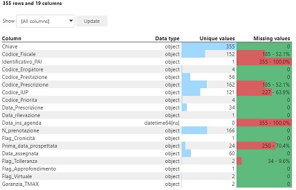
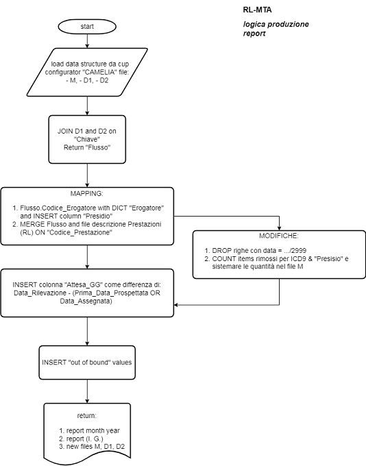

## Processo Elaborazione dati RL-MTA

### (analisi tempi di attesa ambulatoriali)

In ottemperanza alle disposizioni Regionali vigenti in tema di <u>rilevazione dei Tempi di Attesa</u> ([DGR n_XI_1865 del 2019](./Doc/DGR%20n_XI_1865%20del%202019%20tempi%20d'attesa.pdf) e [Disciplinare Tecnico Ambulatoriale, Ricoveri e Radioterapia versione Aprile 2011](./Doc/RL-MTA_DisciplinareTecnicoAnno_2011.pdf)) e seguenti modifiche si presenta di seguito un metodo utilizzato per:

- recuperare i dati di interesse,
- analisi dei dati (congruità rispetto alle procedure ed al disciplinare),
- eventuale modifica e/o correzione dei dati,
- integrare l'informazione allo scopo di produrre reportistica utile al RUA (per l'analisi con i responsabili di U.O.) ed alla segreteria della DMP (per la pubblicazione sul portale "Amministrazione Trasparente"),
- produrre il flusso dati definitivo da inviare in Regione, ATS, Ministero attraverso il portale SMAF.

Risorse utilizzate:

- un calcolatore con installato PYTHON (linguaggio di scripting utilizzato per analisi dati sia a scopo scientifico, in Intelligenza Artificiale, e molto altro),
- PYTHON è un linguaggio potente ed efficace per l'analisi dati ma soprattutto EFFICIENTE poiché OPEN-SOURCE.

Riferimenti sulle caratteristiche di Python: 

- https://www.geeksforgeeks.org/python-features/
- https://www.javatpoint.com/python-features
- https://techvidvan.com/tutorials/features-of-python/
- https://en.wikipedia.org/wiki/Python_(programming_language)

#### 1 - Recupero dati e analisi iniziale

I dati sono estratti dalla base dati del CUP attraverso un estrattore, applicazione integrata nel configuratore del CUP "CAMELIA". La struttura con cui sono estratti è rappresentata nel seguente diagramma dei dati:

I dati presenti in questi 3 file vengono caricati in memoria, vengono visualizzate le caratteristiche principali di questa struttura dati per notare quali campi contengono *missing value*, quali sono i dati identificativi di ogni singolo record (*chiavi primarie* e integrità referenziale), eventuali valori incongrui passibili di rimozione (nel nostro caso le date non assegnate avevano un valore data del 31.12.2999) , etc...

Esempio di visualizzazione struttura dati di un file:

#### 2 - Integrazione del contenuto informativo

 I dati estratti dal database del CUP (CAMELIA) sono grezzi, utilizzati così sono scarsamente leggibili e interpretabili dai più, la struttura dati va integrata  con le descrizioni delle terapie utilizzando il nomenclatore regionale e la descrizione dei presidi erogatori. Per comodità viene costruita una matrice unica con operazioni di JOIN e/o MERGE.

Dopo l'eliminazione dei record con le date delle prenotazioni non disponibili e/o incongruenti ed eventuali altre modifiche ad hoc, vengono elaborati e preparati i report da distribuire alle altre strutture aziendali (RUA e Segreteria DMP).

Di seguito un esempio dei report prodotti:

- [Report RUA](./ReportHTML/Report_Interno.html) 
- [Report DMP](./ReportHTML/Report_Portale.html) 

#### 3 - Invio dati su portale SMAF

Al termine della procedura vengono automaticamente salvati i dati nel formato idoneo per l'invio a Regione Lombardia, ATS o Ministero attraverso il portale SMAF. 

I 3 file in formato CSV per l'invio vengono salvati nella cartella `./DatiInvioSMAF`

#### 4 - Struttura del Processo

Il seguente diagramma illustra la struttura (file system) del progetto.

1. nella cartella `./DatiAccessori` è contenuto il file del Nomenclatore Regionale per la codifica delle prestazioni;
2. nella cartella `./DatiInvioSmaf` sono contenuti i file prodotti alla fine del processo per ottemperare al debito informativo verso le istituzioni;
3. nella cartella `./DatiLoadFlussoMTA` sono contenuti i dati con le informazioni iniziali estratte dal database del CUP che sono nello stesso formato utile per l'invio sul portale SMAF;
4. nella cartella `./ReportHTML` sono contenuti i file HTML e CSS con cui viene formata e **distribuita** la reportistica  a livello aziendale:
5. infine gli ultimi 2 file nella `directory principale` sono il file `RL_MTA.py` che contiene il codice utile per tutto il processo ed il file `RL_MTA.ipynb` che può essere eseguito in un `NOTEBOOK` di `JUPYTER` ed aiuta i visualizzare i vari passaggi ed eventualmente  a interagire sull'analisi da effettuare.

Il flusso di lavoro dell'intero processo può essere schematicamente sintetizzato (come forma standard) nel seguente diagramma di flusso.

#### 5 - Note conclusive

Tutti questi processi di analisi dati si possono risolvere in modi differenti, tra cui, non ultimo, il procedimento manuale di reperimento dei dati e compilazione delle tabelle; io ho risolto lo stesso procedimento con altre tecnologie tra cui strumenti di BI (Business Intelligence) come Qlik, ma soprattutto vorrei sottolineare l'uso di EXCEL con lo strumento Power Query per la trasformazione e preparazione dei dati e Power BI (opzionale, è l'applicazione per BI di Microsoft).

Nel repository metto anche la una cartella con i file excel utilizzati per organizzare lo scarico e l'analisi dei dati in automatico, nei file sono attive alcuni sezioni macro di Power Query scritte ulitizzando DAX; sono stati impostati percorsi relativi in modo che spostando il file excel e cambiando i file dati (quelli sempre nella stessa cartella : `".\DatiLoadFlussoMTA"`) il tutto va in automatico .
